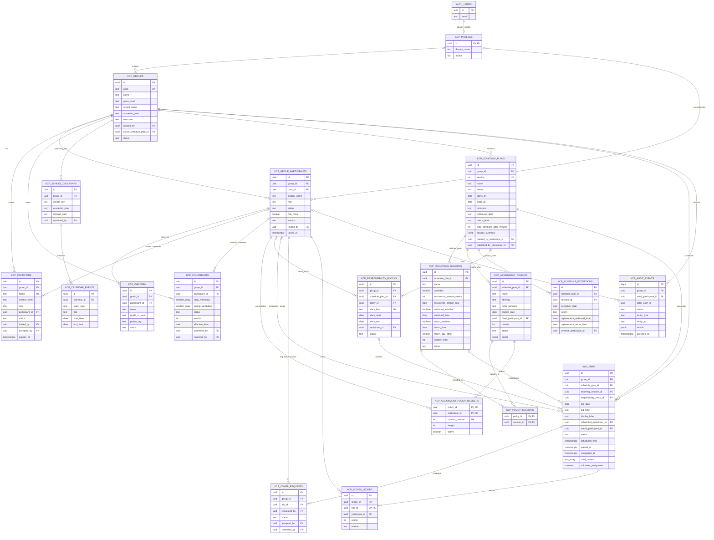
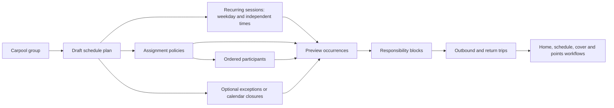

# Kidscarpool Supabase database ER diagram

This diagram reflects the baseline schema in
`supabase/migrations/00000000000001_kcp_baseline.sql` (19 tables).

Supabase `auth.users` owns authentication identities. `kcp_profiles` is the
application profile keyed by the same UUID. `kcp_group_participants` is the
single per-group identity: it carries role, status and driving capability, and
is what schedules, trips and points reference. There is no separate membership
table, so no synchronisation triggers are needed.

## Schedule generation flow

## Integrity and security rules

- Every application table has Row-Level Security enabled. A person can read
  only groups in which they are an active participant.
- A group is created atomically with its creator as the single active owner and
  an initial draft schedule plan.
- **Exactly one active owner** per group with active participants is enforced by
  a *deferred* constraint trigger on `kcp_group_participants`, checked at
  `COMMIT`. It deliberately is **not** an immediate partial unique index: an
  immediate index rejects the transient two-owner state that an atomic owner
  transfer or account recovery must pass through. See
  `supabase/tests/regression_owner_invariant.sql`.
- `kcp_group_participants` is the stable per-group identity. An auth UUID can
  be repointed without disturbing schedule membership or trip history.
- Recurring sessions store times per weekday/session and support any clock
  time, outbound-only, return-only, both legs, multi-week intervals, and return
  legs up to two days later.
- Assignment strategies are data, not code branches: `fixed`,
  `round_robin_trip`, `round_robin_day`, `round_robin_week`, `balanced`,
  `manual`. No participant name appears in any function body; CI enforces this.
- A responsibility block keeps rides that must stay together on one participant.
- Calendars and exceptions are optional; a plan can generate from sessions alone.
- Publishing supersedes the previous plan and creates a new version. Older
  plans and their trips remain for audit and comparison.
- `kcp_audit_events` is append-only; a trigger rejects updates and deletes.
- One points-ledger row per trip prevents duplicate awards.
- One open cover request per trip.
- No credential material is stored by the application. Authentication is
  delegated entirely to Supabase Auth.

## The BASIS pilot

BASIS is seed **data**, not a code path: see `supabase/seeds/basis_pilot.sql`.
Monday–Thursday are four `fixed` policies scoped to one weekday session each;
Friday is one `round_robin_day` policy over the same four participants.
`supabase/tests/equivalence_basis_generic.sql` asserts this reproduces the
retired hardcoded generator exactly.
