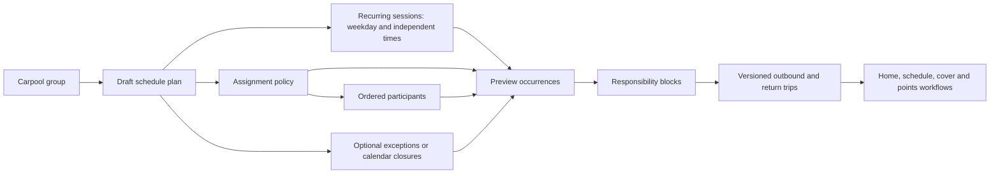

# Kidscarpool Supabase database ER diagram

This diagram reflects the normalized KCP pilot schema through migration `202608060019`. Supabase `auth.users` owns authentication identities. `kcp_profiles` is the application profile keyed by the same UUID, while `kcp_group_participants` is the stable operational identity used by schedules and trips.

```mermaid
erDiagram
    AUTH_USERS ||--o| KCP_PROFILES : "identity / profile"

    KCP_PROFILES |o--o{ KCP_GROUPS : creates
    KCP_GROUPS ||--o{ KCP_MEMBERSHIPS : contains
    KCP_PROFILES ||--o{ KCP_MEMBERSHIPS : joins

    KCP_GROUPS ||--o{ KCP_GROUP_PARTICIPANTS : operates_with
    KCP_PROFILES |o--o{ KCP_GROUP_PARTICIPANTS : currently_links
    KCP_GROUP_PARTICIPANTS ||--o{ KCP_CHILDREN : cares_for

    KCP_GROUPS ||--o{ KCP_INVITATIONS : issues
    KCP_PROFILES ||--o{ KCP_INVITATIONS : "invites / accepts"

    KCP_GROUPS ||--o{ KCP_CONSTRAINTS : owns
    KCP_PROFILES ||--o{ KCP_CONSTRAINTS : configures
    KCP_GROUPS ||--o{ KCP_CONSTRAINT_REQUESTS : reviews
    KCP_PROFILES ||--o{ KCP_CONSTRAINT_REQUESTS : submits

    KCP_GROUPS ||--o{ KCP_ROSTER_SLOTS : preloads
    KCP_PROFILES |o--o{ KCP_ROSTER_SLOTS : claims

    KCP_GROUPS ||--o{ KCP_SCHOOL_CALENDARS : optionally_has
    KCP_SCHOOL_CALENDARS ||--o{ KCP_CALENDAR_EVENTS : contains

    KCP_GROUPS ||--o{ KCP_SCHEDULE_PLANS : versions
    KCP_SCHEDULE_PLANS ||--o{ KCP_RECURRING_SESSIONS : defines_when
    KCP_SCHEDULE_PLANS ||--o{ KCP_ASSIGNMENT_POLICIES : defines_who
    KCP_ASSIGNMENT_POLICIES ||--o{ KCP_POLICY_SESSIONS : applies_to
    KCP_RECURRING_SESSIONS ||--o{ KCP_POLICY_SESSIONS : included_in
    KCP_ASSIGNMENT_POLICIES ||--o{ KCP_ASSIGNMENT_POLICY_MEMBERS : rotates
    KCP_GROUP_PARTICIPANTS ||--o{ KCP_ASSIGNMENT_POLICY_MEMBERS : participates
    KCP_SCHEDULE_PLANS ||--o{ KCP_SCHEDULE_EXCEPTIONS : overrides

    KCP_GROUPS ||--o{ KCP_SCHEDULE_VERSIONS : publishes
    KCP_SCHEDULE_PLANS ||--o{ KCP_RESPONSIBILITY_BLOCKS : groups_rides
    KCP_GROUP_PARTICIPANTS |o--o{ KCP_RESPONSIBILITY_BLOCKS : owns_block

    KCP_GROUPS ||--o{ KCP_TRIPS : schedules
    KCP_SCHEDULE_PLANS |o--o{ KCP_TRIPS : generates
    KCP_RECURRING_SESSIONS |o--o{ KCP_TRIPS : instantiates
    KCP_RESPONSIBILITY_BLOCKS |o--o{ KCP_TRIPS : bundles
    KCP_GROUP_PARTICIPANTS |o--o{ KCP_TRIPS : "scheduled / actual participant"
    KCP_PROFILES |o--o{ KCP_TRIPS : "current auth driver compatibility"

    KCP_TRIPS ||--o{ KCP_COVER_REQUESTS : coverage
    KCP_PROFILES ||--o{ KCP_COVER_REQUESTS : "requests / accepts / cancels"

    KCP_TRIPS ||--o| KCP_POINTS_LEDGER : awards
    KCP_PROFILES ||--o{ KCP_POINTS_LEDGER : earns

    KCP_GROUPS ||--o{ KCP_AUDIT_EVENTS : records
    KCP_PROFILES |o--o{ KCP_AUDIT_EVENTS : acts

    KCP_GROUPS ||--o| KCP_GROUP_SNAPSHOTS : legacy_bridge
    KCP_GROUPS ||--o{ KCP_DEVICE_LINKS : remembers
    KCP_PROFILES ||--o{ KCP_DEVICE_LINKS : owns

    KCP_GROUPS ||--o{ KCP_RECOVERY_CHALLENGES : secures
    KCP_PROFILES ||--o{ KCP_RECOVERY_CHALLENGES : "claimed / used"

    AUTH_USERS {
        uuid id PK
        text email
        boolean is_anonymous
    }

    KCP_PROFILES {
        uuid id PK, FK
        text display_name
        text phone
        timestamptz created_at
        timestamptz updated_at
    }

    KCP_GROUPS {
        uuid id PK
        text code UK
        text name
        text group_kind
        text school_name
        text academic_year
        text timezone
        uuid created_by FK
        uuid active_schedule_plan_id FK
        int current_schedule_version
        text schedule_policy
        text status
    }

    KCP_MEMBERSHIPS {
        uuid group_id PK, FK
        uuid user_id PK, FK
        text parent_name
        text child_name
        int grade
        text role
        text status
        uuid invited_by FK
        timestamptz joined_at
    }

    KCP_GROUP_PARTICIPANTS {
        uuid id PK
        uuid group_id FK
        uuid user_id FK
        text display_name
        boolean can_drive
        text status
        text source
    }

    KCP_CHILDREN {
        uuid id PK
        uuid group_id FK
        uuid participant_id FK
        text name
        text grade_or_level
        int legacy_grade
        text pickup_tag
        text status
    }

    KCP_INVITATIONS {
        uuid id PK
        uuid group_id FK
        text token UK
        text invited_parent_name
        text child_name
        int grade
        text role
        text status
        uuid invited_by FK
        uuid accepted_by FK
        timestamptz expires_at
        timestamptz accepted_at
    }

    KCP_CONSTRAINTS {
        uuid group_id PK, FK
        uuid user_id PK, FK
        smallint_array drop_weekdays
        smallint_array pickup_weekdays
        text notes
        int version
        date effective_from
        uuid updated_by FK
    }

    KCP_CONSTRAINT_REQUESTS {
        uuid id PK
        uuid group_id FK
        uuid user_id FK
        smallint_array requested_drop_weekdays
        smallint_array requested_pickup_weekdays
        text status
        uuid reviewed_by FK
        int base_version
    }

    KCP_ROSTER_SLOTS {
        uuid id PK
        uuid group_id FK
        text parent_name
        text child_name
        int grade
        text pickup_tag
        smallint fixed_weekday
        smallint friday_rotation_order
        uuid claimed_user_id FK
    }

    KCP_SCHOOL_CALENDARS {
        uuid id PK
        uuid group_id FK
        text school_key
        text academic_year
        text source_sha256
        text storage_path
        uuid uploaded_by FK
    }

    KCP_CALENDAR_EVENTS {
        uuid id PK
        uuid calendar_id FK
        text event_type
        text title
        date start_date
        date end_date
        text notes
    }

    KCP_SCHEDULE_PLANS {
        uuid id PK
        uuid group_id FK
        int version UK
        text name
        text status
        date starts_on
        date ends_on
        text timezone
        text outbound_label
        text return_label
        int auto_complete_after_minutes
        uuid created_by_participant_id FK
        uuid published_by_participant_id FK
    }

    KCP_RECURRING_SESSIONS {
        uuid id PK
        uuid schedule_plan_id FK
        text name
        smallint weekday
        int recurrence_interval_weeks
        date recurrence_anchor_date
        boolean outbound_enabled
        time outbound_time
        boolean return_enabled
        time return_time
        smallint return_day_offset
        text destination_override
        int display_order
        text status
    }

    KCP_ASSIGNMENT_POLICIES {
        uuid id PK
        uuid schedule_plan_id FK
        text name
        text strategy
        text cycle_behavior
        date anchor_date
        uuid fixed_participant_id FK
        int priority
        text status
        jsonb config
    }

    KCP_POLICY_SESSIONS {
        uuid policy_id PK, FK
        uuid session_id PK, FK
    }

    KCP_ASSIGNMENT_POLICY_MEMBERS {
        uuid policy_id PK, FK
        uuid participant_id PK, FK
        int rotation_position UK
        int weight
        boolean active
    }

    KCP_SCHEDULE_EXCEPTIONS {
        uuid id PK
        uuid schedule_plan_id FK
        uuid session_id FK
        date exception_date
        text action
        time replacement_outbound_time
        time replacement_return_time
        uuid override_participant_id FK
        text reason
    }

    KCP_SCHEDULE_VERSIONS {
        uuid id PK
        uuid group_id FK
        int version UK
        text status
        text reason
        uuid generated_by FK
        uuid published_by FK
        jsonb change_summary
    }

    KCP_RESPONSIBILITY_BLOCKS {
        uuid id PK
        uuid group_id FK
        uuid schedule_plan_id FK
        int schedule_version
        uuid policy_id FK
        text block_key UK
        date block_start
        date block_end
        uuid participant_id FK
        text status
    }

    KCP_TRIPS {
        uuid id PK
        uuid group_id FK
        int schedule_version
        date trip_date
        text kind
        text leg_type
        text display_label
        uuid schedule_plan_id FK
        uuid recurring_session_id FK
        uuid responsibility_block_id FK
        uuid scheduled_participant_id FK
        uuid actual_participant_id FK
        uuid scheduled_driver_id FK
        uuid actual_driver_id FK
        text scheduled_driver_name
        text actual_driver_name
        text status
        timestamptz scheduled_time
        text_array child_names
        boolean volunteer_assignment
        text started_source
        text completed_source
    }

    KCP_COVER_REQUESTS {
        uuid id PK
        uuid group_id FK
        uuid trip_id FK
        uuid requested_by FK
        text status
        uuid accepted_by FK
        uuid cancelled_by FK
        text cancellation_reason
        timestamptz accepted_at
        timestamptz cancelled_at
    }

    KCP_POINTS_LEDGER {
        uuid id PK
        uuid group_id FK
        uuid trip_id UK, FK
        uuid user_id FK
        int points
        text reason
    }

    KCP_AUDIT_EVENTS {
        bigint id PK
        uuid group_id FK
        uuid actor_id FK
        text action
        text entity_type
        text entity_id
        jsonb details
        timestamptz occurred_at
    }

    KCP_GROUP_SNAPSHOTS {
        uuid group_id PK, FK
        jsonb snapshot
        uuid updated_by FK
    }

    KCP_DEVICE_LINKS {
        uuid id PK
        uuid group_id FK
        uuid user_id FK
        text secret_hash UK
        text label
        timestamptz last_used_at
        timestamptz revoked_at
    }

    KCP_RECOVERY_CHALLENGES {
        uuid id PK
        uuid group_id FK
        text roster_parent_name
        uuid claimed_user_id FK
        text secret_hash UK
        timestamptz expires_at
        timestamptz used_at
        uuid used_by FK
    }
```

## Generic schedule generation flow

## Integrity and security rules

- Every user-facing application table has Row-Level Security enabled. Parents can read only groups in which they have an active membership.
- A fresh group is created atomically with the creator as the single active Owner and with an initial draft schedule plan.
- A partial unique index permits only one active Owner membership per group. Multiple Admins remain supported.
- `kcp_group_participants` is the stable operational identity. An anonymous Auth UUID can be recovered or replaced without changing schedule-plan membership or historical participant assignments.
- Recurring sessions store times per weekday/session. They support any clock time, drop-only, pickup-only, both legs, multi-week intervals, and return legs up to two days later.
- Assignment strategies are data, not hard-coded branches: fixed, per-trip rotation, per-day rotation, per-week bundled rotation, balanced, and manual.
- A responsibility block guarantees that rides which must stay together—such as all configured sessions in one rotation week—use the same participant.
- Calendars and exceptions are optional. A plan can generate solely from its recurring sessions.
- Publishing creates a new `kcp_schedule_versions` row and new trips. Older schedule versions remain available for audit and comparison.
- `kcp_audit_events` is append-only. A database trigger rejects updates and deletes.
- Only one points-ledger row is allowed per trip, preventing duplicate automatic or manual awards.
- Only one open cover request is allowed per trip.
- Device and one-time recovery secrets are never stored in plaintext. PostgreSQL stores SHA-256 hashes; plaintext is returned only once to the authorized client or Supabase project operator.

## Compatibility layer

Existing screens and records continue to receive `morning_drop` or `afternoon_pickup` in the legacy `kind` column while generic records also carry `leg_type = outbound|return` and an administrator-defined `display_label`. The compatibility fields can be retired after all native and web clients use the generic fields.
